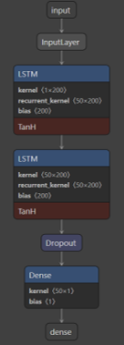
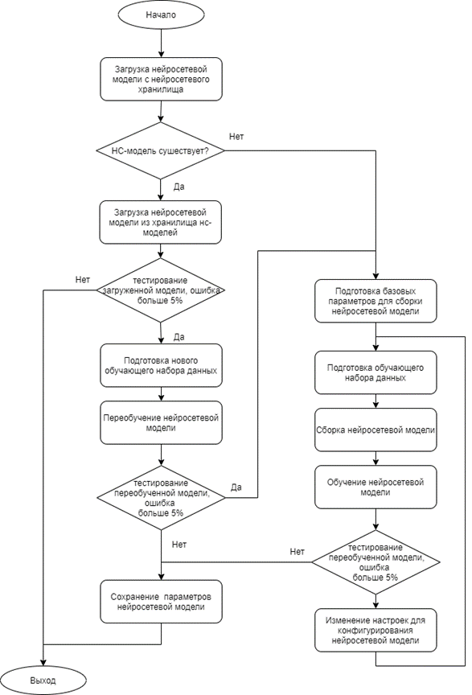

## AR-Project
Это прототип асинхронного серверного модуля входящего в состав проекта "Система сопровождения производственных объектов при помощи дополненной реальности". 

Данный модуль обеспечивает следующие функции:
1. Обеспечивает соединение с клиентами (мобильныйми приложениями и не только) и обмен данными по протоколу TCP/IP;
2. Выполняет приём сообщений представленных в формате XML;
3. Выполняет распаковку и упаковку XML-контейнеров;
4. Выполняет обработку запросов и формирует ответ;
5. Осуществляет прогнозирование показателей объекта на основе исторических данных;
6. Выполняет аутентификацию/авторизацию пользователей пользователей.

**Струкутура сервера имеет следующий вид:**


---
## Прогнозирование
Модуль прогнозирования использует следующие технологии:
1. Библиотеку [**RDFlib**](https://pypi.org/project/rdflib/) для работы с базой знаний и хранения в ней сведений об актуальной нейросетевой модели;
2. Библиотеку [**Keras**](https://keras.io/) для работы с нейросетевыми моделями;
3. Библиотеку [**PyMongo**](https://pypi.org/project/pymongo/) для работы с базами данных MongoDB и хранимыми в ней данными об объектах, датчиков, пользователях и данными для построения AR-интерфейса на клиентском приложении.

Серверный модуль прогнозирования испольует в качетсве модели нейросетевую двухслойную модель со слоями LSTM



Модуль работы с нейронными сетями выполняет в автоматическом порядке:
1. Сканирование базы знаний на поиск актуальной нейросетевой модели*;
2. Провека модели на адекватность **;
3. Подготовка данных для обученя, переобучения, тестирования модели и генерации прогнозных значений.
4. Обучение новой нейросетевой прогностической модели;
5. Переобучение новой нейросетевой прогностической модели;
6. Генерация предсказаний на основе актуальной нейросетевой прогностической модели;
<br><i> * актуальная нейросетевая модель  - модель, прогнозы которой по велечинам отклоняются не более чем на 5%.</i>
<br><i> ** адекватная модель  - модель, прогнозы которой по велечинам отклоняются не более чем на 5%.</i>

Работа прогнозирующего модуля выполняется по следующему алгоритму:



---
## Обработка запросов на сервере
Для обмена данными с сервером клиенту необходимо отвправлять ему запросы, которые помещаются в специальный XML-контейнер.

Вид XML запроса:
```XML
<?xml version="1.0" encoding="utf-8"?>
<message>
   <method>
      methodName
   </method>
   <parameters>
      ...
   </parameters>
</message>
```

Вид XML ответа:
```XML
<?xml version='1.0' encoding='utf-8'?>
<message>
    <method>
        response
    </method>
    <data>
        ...
    </data>
</message>
```

Обработчик запроса на данны момет обрабатывает следующие методы (*methodName*):
*   **getLast**   - возврат последних значений объекта;
*	**logIn**	- аутентификация пользователя;
*	**getBuildSettings** – запрос на настройки для графопостроителя интерфейса AR;
*	**setBuildSettings** – запись настроек для интерфейса AR;
*	**getPublicKey** – запрос на публичный ключ для передачи данных в зашифрованном виде (Шифрование производится алгоритмом  **RSA-OAEP**);
*	**getPrognose** – запрос на прогнозные показания по сопровождаемому в данный момент объекту
*	**setNewStatus** – включение/выключение объекта управления

Добавление обрабатываемых запросов выполняется добавлением соответствующей ветки в обработчике запросов *HandleRequest.py*

Структура обработчика запросов следующая:

if method == “method_name_1”:
*блок обработки запроса method_name_1*

elif method == “method_name_2”:
*блок обработки запроса method_name_2*

...

Else:
*сообщение о неправильном выбранном методе запроса*
